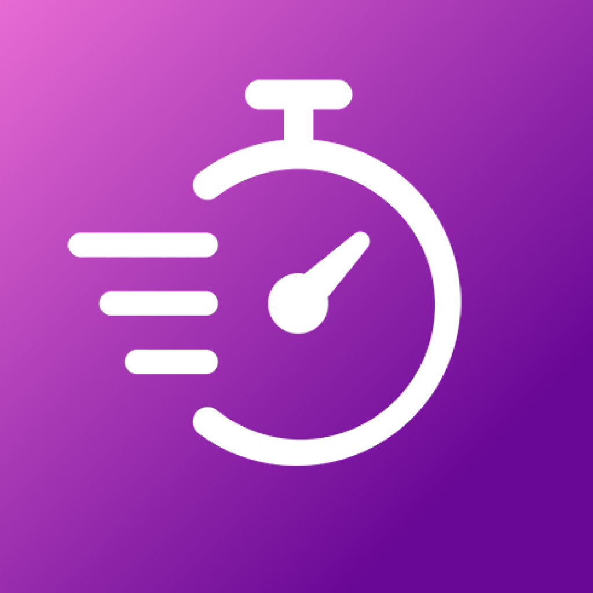

  

# Interval Timer Flutter App

A interval training timer written with Flutter for which is compatible with iOS and Android devices. This app was was built for my Honours Project at Carleton University during the Winter 2021 semester, supervised by Professor Louis Nel.

## Getting Started

- [Install Flutter](https://flutter.dev/docs/get-started/install)
- [Instal the Dart SDK](https://dart.dev/get-dart)

## Abstract
High-intensity interval training (HIIT) is a form of interval training which generally combines short bursts of intense exercise with periods of rest or lower-intensity exercise. It is a quick and effective way to increase metabolism, improve cardiovascular endurance and build muscle which can be done anywhere without additional equipment. The purpose of this mobile application is to create a sleek, modern interval timer which is accessible on both iOS and Android. In order to do this, the application will be developed using Google’s Flutter development toolkit.

The user is able to customize the following aspects of the timer...
- Number of reps in the workout
- Time spent exercising for each rep
- Rest time between each rep
- Number of sets in the workout
- Rest time between each set

## App Screenshots
- [App Demo](https://youtu.be/y8hMDminsJk)

  

  

  

  

## Acknowledgements
- Sounds obtained from [ZapSplat](https://www.zapsplat.com/)
